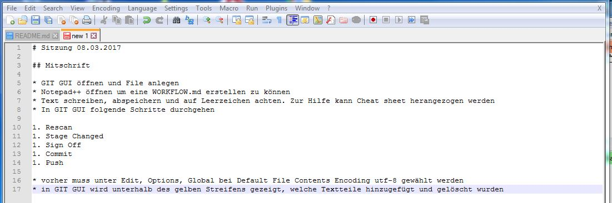
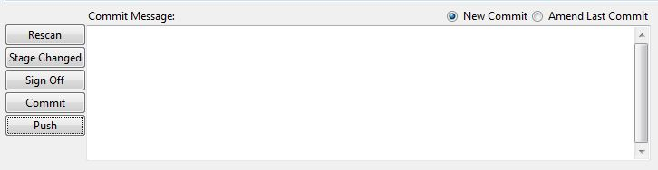

# Sitzung 08.03.2017

## Mitschrift

* GIT GUI öffnen und File anlegen
* Notepad++ öffnen um eine WORKFLOW.md erstellen zu können
* Text schreiben, abspeichern und auf Leerzeichen achten. Zur Hilfe kann Cheat sheet herangezogen werden
 
* In GIT GUI folgende Schritte durchgehen

1. Rescan
1. Stage Changed
1. Sign Off
1. Commit
1. Push 

 

* Zusatzinfo: vorher muss unter Edit, Options, Global bei Default File Contents Encoding utf-8 gewählt werden
* in GIT GUI wird unterhalb des gelben Streifens gezeigt, welche Textteile hinzugefügt und gelöscht wurden

* Unter [github](https://github.com/) einen Account anlegen und ein neues Projekt anlegen
* Link wird erstellt
* Unter Remote und Add kann der Link hinzugefügt werden. Dies wird gemacht, damit verschiedene User auf das Projekt zugreifen können